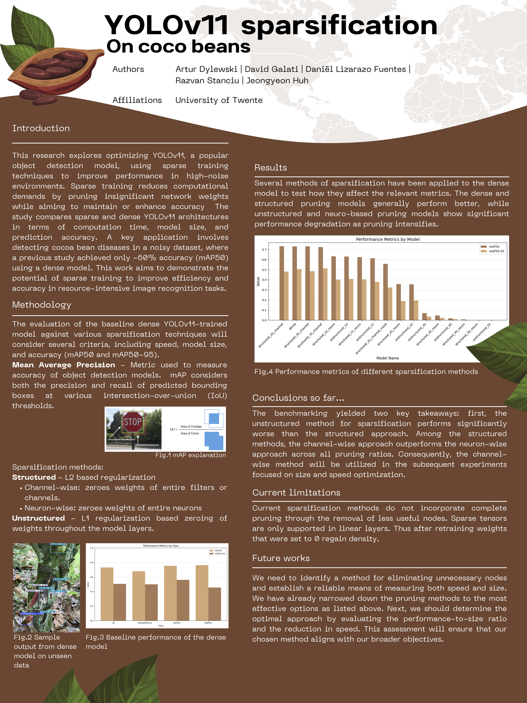

# Cocoa Bean Detection and Disease Classification Using Sparse YOLO

This repository contains the research and implementation for the project on detecting diseases in cocoa beans using sparse training techniques with YOLOv11. The primary goal is to optimize model performance for high-noise datasets while reducing computational demands.

---

## Abstract

This research investigates the application of sparse training techniques to YOLOv11 for detecting diseases in cocoa beans. By reducing computational demands and optimizing performance in high-noise datasets, we aim to demonstrate how structured sparsification can maintain or even enhance prediction accuracy. Benchmarking against dense YOLOv11 models, this study evaluates the trade-offs in accuracy, model size, and computational efficiency.

---

# [Full Report PDF](./Cocoa_Bean_Sparse_YOLO_Final_Report.pdf)

## Introduction & Motivation

The Netherlands is a major global importer of cocoa beans, trading 20-25% of the world's supply. The Dutch agricultural industry's reliance on a stable supply is threatened by cocoa bean diseases, which can significantly reduce production. Early and accurate detection of these diseases is crucial for maintaining supply chain stability.

This project addresses the challenge by applying advanced computer vision techniques. We utilize a YOLOv11 model, enhanced with sparse training methods, to accurately detect and classify healthy and diseased cocoa beans from image data.

---

## Methodology

Our approach is centered around model sparsification, a technique aimed at reducing a model's complexity and size without significant loss of accuracy. This is particularly beneficial for deployment on resource-constrained devices.

1.  **Baseline Model:** A dense YOLOv11 model is trained on a dataset of cocoa bean images to establish a performance baseline.
2.  **Sparsification Techniques:** We apply various pruning methods to the dense model:
    * **Unstructured Pruning:** Individual weights are removed from the model.
    * **Structured Pruning (Neuron-wise & Channel-wise):** Entire neurons or channels are removed, leading to more significant model size reduction.
3.  **Retraining:** After pruning, the sparse models are retrained to allow the remaining weights to adjust and recover any lost accuracy, a concept inspired by the "Lottery Ticket Hypothesis".
4.  **Evaluation:** The performance of the sparse models is compared against the dense baseline using metrics such as precision, recall, F1-score, and mean Average Precision (mAP).

---

## Key Findings

-   **High Accuracy:** The dense YOLOv11 model achieved a high accuracy, with a mAP of 94.6%, demonstrating its effectiveness for this classification task.
-   **Successful Sparsification:** We were able to successfully sparsify the model. For example, a neuron-wise structured pruning approach at 10% sparsity maintained a high mAP of 92.5%.
-   **Performance Trade-offs:** The results show a clear trade-off between the level of sparsity and model accuracy. While pruning reduces model size and computational cost, it can lead to a slight decrease in performance. However, with retraining, this loss is often minimal.
-   **Lottery Ticket Hypothesis:** Our findings align with the Lottery Ticket Hypothesis, showing that smaller, sparse sub-networks can be trained to achieve performance comparable to their larger, dense counterparts.

---

## How to Use This Repository

This repository contains the code, data, and results for this research. To replicate the experiments, you will need to:
1.  Set up a Python environment with the necessary libraries (e.g., PyTorch, Ultralytics).
2.  Use the provided notebooks or scripts to train the baseline dense model.
3.  Apply the pruning scripts to create sparse versions of the model.
4.  Retrain the sparse models.
5.  Use the evaluation scripts to compare the performance of all models.

---

## Authors

* Razvan Stanciu
* David Galati
* Jeongyeon Huh
* Artur Dylewski
* Louis Daniël Lizarazo Fuentes

# Install dependencies
Run dependencies.ipynb

# Import data and preprocess:
Data can already be found in the correct format in datasets/cocoa_diseases.
To get an idea about the data format of the labels (bounding boxes and classes) accepted by YOLO, 
take a look at preprocessing.ipynb. No need to run the commands, since the data is already created.

# cocoa_pipeline_dense.ipynb

This notebook is a basic pipeline for the dense model training. It makes use of wandb, a library
integrated with ultralytics which is useful for logging and comparing different model architectures
and training/validation results.
Furthermore, I am trying to understand what the trained model file contains and how to access its weights and layers.

# Sparsification folder

We will apply the pruning method for sparsification and, if time and knowledge allows for, quantization. I will post some resources
below where you can learn more about these methods.
PyTorch provides APIs for applying pruning and a beta for quantization.
It is important that we experiment with different architectures and compare model sizes, performance, time for training/inference.

# Resources

Object detection performance metrics: https://jonathan-hui.medium.com/map-mean-average-precision-for-object-detection-45c121a31173
Pruning: https://www.datature.io/blog/a-comprehensive-guide-to-neural-network-model-pruning
Quantization: https://www.datature.io/blog/introducing-post-training-quantization-feature-and-mechanics-explained
YOLO11 architecture explained in more detail: https://www.youtube.com/watch?v=L9Va7Y9UT8E&ab_channel=Dr.PriyantoHidayatullah
TESTING PERFORMANCE - https://github.com/ultralytics/thop

